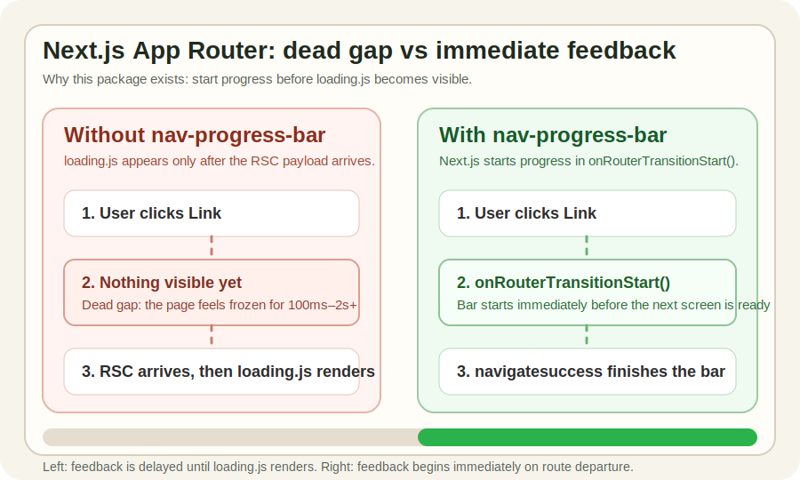

# @vctqs1/nav-progress-bar-react

React wrapper for [`@vctqs1/nav-progress-bar`](https://www.npmjs.com/package/@vctqs1/nav-progress-bar) — a zero-dependency, CSP-safe top-of-page progress bar built as a native Web Component.

> Live demo: https://nav-progress-bar-git-main-vctqs1s-projects.vercel.app/

> Demo video:

<video src="https://github.com/user-attachments/assets/4144ed95-8c25-4aa9-b804-905ac24805b4" controls width="100%"></video>

This package provides a thin React component that renders the `<vctqs1-nav-progress-bar>` custom element with proper TypeScript JSX types and SSR support via Declarative Shadow DOM.

> Originally built to solve the [Next.js App Router `loading.js` dead gap](https://github.com/vercel/next.js/issues/43548), but the underlying mechanism (the browser [Navigation API](https://developer.mozilla.org/en-US/docs/Web/API/Navigation_API)) works anywhere.

> If you use Next.js App Router, this is the missing feedback layer before `loading.js` renders.

## Table of Contents

- [Installation](#installation)
- [Packages](#packages)
- [Quick Start](#quick-start)
  - [Next.js App Router](#nextjs-app-router-recommended-setup)
  - [Custom color](#custom-color)
  - [React SPA (Vite, CRA, etc.)](#react-spa-vite-cra-etc)
- [Why](#why)
- [Props](#props)
- [How SSR Works](#how-ssr-works)
- [Why a Separate Package?](#why-a-separate-package)
- [Related](#related)
- [License](#license)

## Installation

```bash
npm install @vctqs1/nav-progress-bar @vctqs1/nav-progress-bar-react
# or
pnpm add @vctqs1/nav-progress-bar @vctqs1/nav-progress-bar-react
```

## Packages

| Package | Description |
|---------|-------------|
| [`@vctqs1/nav-progress-bar`](https://www.npmjs.com/package/@vctqs1/nav-progress-bar) | Core Web Component — zero dependencies, framework-agnostic |
| [`@vctqs1/nav-progress-bar-react`](https://www.npmjs.com/package/@vctqs1/nav-progress-bar-react) | React wrapper with SSR support and JSX types |


## Quick Start

### Next.js App Router (recommended setup)

This is the main reason to use this package: immediate route feedback before App Router finishes loading the next screen.

**1. Add to root layout** (`app/layout.tsx`):

```tsx
import NavProgressBar from '@vctqs1/nav-progress-bar-react';

export default function RootLayout({ children }: { children: React.ReactNode }) {
  return (
    <html>
      <body>
        <NavProgressBar />
        {children}
      </body>
    </html>
  );
}
```

**2. Create `instrumentation-client.ts`** at the project root:

```ts
import { registerNavProgressBar, getNavProgressBar } from '@vctqs1/nav-progress-bar-react';

registerNavProgressBar();

export function onRouterTransitionStart(
  url: string,
  navigationType: 'push' | 'replace' | 'traverse',
) {
  getNavProgressBar()?.start();
}
```

That's it. In Next.js App Router, the bar starts from `onRouterTransitionStart()` on every route departure and finishes automatically when the new page commits.

---

### Custom color

```tsx
<NavProgressBar primary="#ff6600" />
```

```tsx
<NavProgressBar primary="--your-brand-color" />
```

---

### React SPA (Vite, CRA, etc.)

For non-SSR React apps, register and place the component anywhere above your routes:

```tsx
// main.tsx
import { registerNavProgressBar } from '@vctqs1/nav-progress-bar-react';
registerNavProgressBar();
```

```tsx
// App.tsx
import NavProgressBar from '@vctqs1/nav-progress-bar-react';

export default function App() {
  return (
    <>
      <NavProgressBar />
      <RouterProvider router={router} />
    </>
  );
}
```

In a plain SPA the bar auto-starts and auto-finishes via the browser Navigation API — no extra wiring needed.

## Why



In Next.js App Router, `loading.js` is a React Suspense boundary — it only renders **after** the RSC payload arrives. On slow connections this creates a dead period of 100ms–2s+ where the page looks frozen after a user clicks a link.

```
User clicks Link
  → nothing visible happens   ← dead gap: page looks frozen
  → RSC payload arrives
  → React renders Suspense shell
    → loading.js displays      ← feedback finally appears
```

This is a known App Router limitation:
- [Next.js issue #43548 — loading.js not shown immediately on navigate](https://github.com/vercel/next.js/issues/43548)
- [Reddit thread — loading state does not show when navigating](https://www.reddit.com/r/nextjs/comments/1c3ngkh/the_loading_state_does_not_show_when_i_navigate/)


`@vctqs1/nav-progress-bar` fills that gap by starting from Next.js `onRouterTransitionStart()` — synchronously on route departure, before the next screen is ready:

```
User clicks <Link> / router.push()
  → Next.js dispatches ACTION_NAVIGATE (React startTransition)   [app-router-instance.ts#L457-L474]
  → Next.js calls history.pushState() to update the URL          [app-router.tsx#L52-L54]
    → browser fires "navigate"       → bar starts
      → Next.js fetches RSC payload
        → React patches the tree
          → Next.js finalises with history.pushState()           [app-router.tsx#L52-L54]
            → browser fires "navigatesuccess" → bar finishes
```

Next.js App Router does **not** call `navigation.navigate()` directly. It manages routing internally via its own action queue ([`dispatchAppRouterAction`](https://github.com/vercel/next.js/blob/v16.2.6/packages/next/src/client/components/app-router-instance.ts#L457-L474)) using React `startTransition`, then calls `history.pushState()` to update the URL. The browser Navigation API fires `navigate` and `navigatesuccess` as a side effect of those `history` mutations.


## Props

| Prop | Type | Default | Description |
|------|------|---------|-------------|
| `primary` | `string` | `#006bde` | Bar color — accepts any CSS color or a `--css-variable` name |

## How SSR Works

The component renders a `<vctqs1-nav-progress-bar>` custom element server-side. It uses `<template shadowrootmode="open">` (Declarative Shadow DOM) to pre-render the bar div so the element has visual structure before JavaScript runs — preventing a flash of invisible bar during hydration.

When the custom element upgrades in the browser it detects the existing shadow root:

```ts
const shadow = this.shadowRoot ?? this.attachShadow({ mode: 'open' });
```

And skips creating a duplicate bar div if one already exists:

```ts
if (!shadow.querySelector('.bar')) {
  const bar = document.createElement('div');
  bar.className = 'bar';
  shadow.append(bar);
}
```

## Why a Separate Package?

The core `@vctqs1/nav-progress-bar` package has zero dependencies and works in any environment. This wrapper exists solely to:

1. Provide correct TypeScript JSX types for `<vctqs1-nav-progress-bar>` so React doesn't complain about an unknown element
2. Ship a typed React component with a clean import
3. Handle the Declarative Shadow DOM template for SSR without pulling React into the core package

## Related

- [`@vctqs1/nav-progress-bar`](https://www.npmjs.com/package/@vctqs1/nav-progress-bar) — core Web Component, framework-agnostic
- [Next.js issue #43548](https://github.com/vercel/next.js/issues/43548) — the problem this solves

## License

MIT
